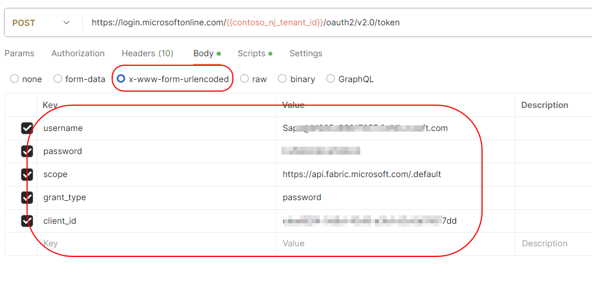

# Generating Token by using username and password. ( not service principal)

This is a stop gap arrangement to generate the token by using the username and password. When Fabric APi will support SPN authentication, we will switch to SPN authentication.

## Here are some pre work is needed before running the script

1. The user account that is used to generate token should not have the MFA enabled.

- How to disable MFA for a user account?

There are various ways to disable the MFA, but the easiest way is to disable it from the entra.microsoft.com portal.

identity -> Overview -> Properties -> Manage Conditional Access -> Multifactor authentication for Microsoft partners and vendors -> Users -> exclude the user from MFA.


2. Create a service principal for delegation and give API permission as it is required. I have given permission only for the workspace. If you would like to give more delegated permission, choose it from the Add a Permission -> search for Power BI Service -> delegated Permissions.


3. Also enable Allow Public client flows in the Authentication -> Advanced settings -> Enable the Allow public client flows.


4. We do not need the client secret for this script. So, do not create the client secret.


## Creating the user access token from Postman ( Using Rest API)

We are going to use the same credentials as before:

### Step 1: Create a Post Method in the Postman to generate the access token:

**Endpoint**: `https://login.microsoftonline.com/{{contoso_tenant_id}}/oauth2/v2.0/token`

**Content-Type**: `application/x-www-form-urlencoded`




Assign the access token into the variable from the Script section.

```javascript
const jsonResponse = pm.response.json()
pm.globals.set("personal_access_token", jsonResponse.access_token);
```


### Step 2: Call the Get or Post Method of any Fabric API by using the generated token.

**Endpoint**: `https://api.fabric.microsoft.com/v1/workspaces/{{wortkspace_id}}/items/<fabric_data_pipeline_id>/jobs/instances?jobType=Pipeline`


