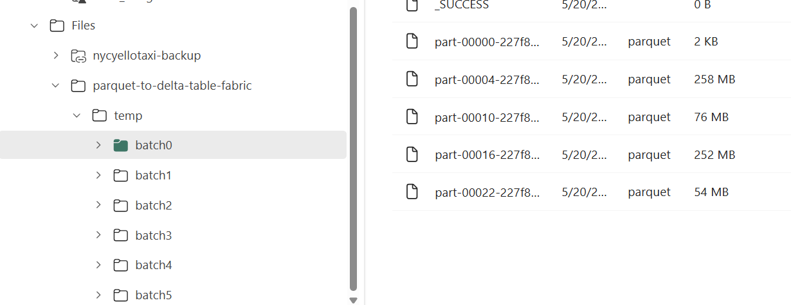
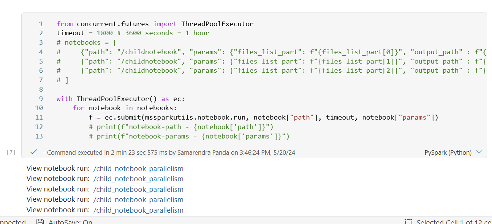

# Parallelism in Spark Notebook Execution in Microsoft Fabric

This blog post discusses the concept of parallelism in Spark notebook execution within the Microsoft Fabric Data Engineering Experience. It explores how parallelism can improve the performance and scalability of data processing tasks in a distributed computing environment.

## Introduction

Parallelism is a fundamental concept in distributed computing that allows multiple tasks to be executed simultaneously, thereby improving the efficiency and performance of data processing workflows. In the context of Spark notebooks within the Microsoft Fabric framework, parallelism plays a crucial role in optimizing the execution of Spark jobs and enhancing the overall data processing capabilities.

## use case

We have [TpCH data ](https://www.nyc.gov/site/tlc/about/tlc-trip-record-data.page) in Azure Data Lake Storage Gen2. Each year has 12 files and we would like to process several years of data in parallel. 

## Parallelism in Fabric Spark Notebooks

In the Microsoft Fabric Data Engineering Experience, Spark notebooks provide a powerful environment for developing and executing data processing workflows. These notebooks leverage the underlying Spark engine to distribute and parallelize data processing tasks across multiple nodes in a cluster.
Having multiple nodes in a cluster allows for parallel execution of tasks, which can significantly improve the performance and scalability of data processing workflows. By dividing the workload into smaller tasks and distributing them across multiple nodes, Spark notebooks can process large volumes of data more efficiently and quickly.

## Compute configurations

Since we intend to process multiple jobs in a spark session, we need to ensure that the compute configuration is optimized for parallel execution. This includes setting the number of executors, the amount of memory allocated to each executor, and the number of cores per executor. By tuning these parameters, we can maximize the parallelism of Spark jobs and improve the overall performance of data processing tasks.

Here are few consideration for compute configurations:
1) We are going to use F64 Capacity Unity (CU) in Fabric. 1 CU = 2 spark vCores. 
2) Fabric capacities are enabled with bursting which allows you to consume extra compute cores beyond what have been purchased to speed the execution of a workload. For Spark workloads bursting allows users to submit jobs with a total of 3X the Spark VCores purchased. Here is more detail about [bursting](https://learn.microsoft.com/en-us/fabric/data-engineering/spark-job-concurrency-and-queueing#concurrency-throttling-and-queueing)
3) Example calculation: `F64 SKU offers 128 Spark VCores`. The burst factor applied for a `F64 SKU is 3`, which gives a total of `384 Spark Vcores`. The burst factor is only applied to help with concurrency and does not increase the max cores available for a single Spark job. That means a single Notebook or Spark Job Definition or Lakehouse Job can use a pool configuration of max 128 vCores and 3 jobs with the same configuration can be run concurrently. If notebooks are using a smaller compute configuration, they can be run concurrently till the max utilization reaches the 384 Spark Vcore limit.
4) We can set the number of executors, the amount of memory allocated to each executor, and the number of cores per executor in the Spark configuration. We can do this by creating the [environment in Fabric ](https://learn.microsoft.com/en-us/fabric/data-engineering/workspace-admin-settings#environment)and attach the Fabric environment to the master notebook, so that master notebook can use the spark session configurations and run the parallel notebook execution with maximum available resources.


    

## Master notebook

[Notebook](dataEngineering\Lakehouse\parallelism_in_notebooks\readme.md)

We can create a master notebook that orchestrates the parallel execution of multiple notebooks. The master notebook can be used to trigger the execution of individual notebooks in parallel, monitor their progress, and aggregate the results. By leveraging the parallelism capabilities of Spark notebooks, we can process large volumes of data more efficiently and quickly. We have defined the number of parallel jobs to be executed =6. We need tweak this number to check how many parallel jobs can be executed before it starts queueing. 

Master notebook performs the following steps: 

1. List the files in the input directory.
2. Filters the files which are required to be processed.
3. Group the files based on the number of jobs that can be run in parallel.
4. Call the child notebooks to process the data in parallel. We have used the [ThreadPoolExecutor](https://docs.python.org/3/library/concurrent.futures.html) method to run the child notebooks in parallel.
    ```python
    notebooks = []
    for i in range(0, no_of_parallel_jobs):
        notebook = {"path": "/child_notebook_parallelism", "params": {"files_list_part": f"{files_list_part[i]}", "output_path" : f"{output_path}/temp/batch{i}"}}
        notebooks.append(notebook)

    # execute the child notebooks in parallel
    from concurrent.futures import ThreadPoolExecutor
    timeout = 1800 # 3600 seconds = 1 hour

    with ThreadPoolExecutor() as ec:
        for notebook in notebooks:
            f = ec.submit(mssparkutils.notebook.run, notebook["path"], timeout, notebook["params"])
    ```

5. Merge the temporary delta tables to create the final delta table.
6. Save the final delta table as a table in the Lakehouse.

## Child notebook

[Notebook](dataEngineering\Lakehouse\parallelism_in_notebooks\child_notebook_parallelism.ipynb)

Child notebooks are responsible for processing a subset of the data in parallel. These notebooks can be triggered by the master notebook and run concurrently to process different parts of the data. 

Child notebook performs the following steps:
1. Read the parameter passed by the master notebook. The child notebook expects which files to be processed and the output path where is should write the data.
2. Read the input data from the specified files.
3. Perform data processing tasks. Here we are adding 2 columns, one to add the hash_key and another column to add the input file name.
4. Union all the dataframes into one dataframe.
5. Write the output data to the specified output path.
    

# Master Notebook Execution

Here is how we would be able to see the different instances of child notebooks are being triggered.

